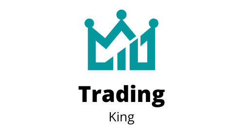

<h1 align="center">Trading King Application</h1>
<p align="center">
  
</p>

<p align='center'>
  
</p>

<p align='center'>Live on <a href="">Vercel</a></p>

<h2>Description</h2>

With this project you can keep track of your favorites stocks. 

Here you can add, remove, check the chart and make decisions about the stock.

<h2>Content</h2>

<p align='center'>
  <a href='#description'>Description</a> •
  <a href='#use'>How to use it</a> •
  <a href='#technologies'>Technologies</a> •
  <a href='#run'>Run it</a> •
  <a href='#features'>Features</a> •
  <a href='#author'>Author</a>
</p>

<h2 id='use'>How to use it</h2>

1. <strong>Search and add</strong>

You can search your favorite stocks just by typing its name in the search bar.

2. <strong>Remove from favorites</strong>

If you hover a table row you'll see a red button "Remove". Just click there to remove a stock from your favorites.

3. <strong>Check stock chart</strong>

Click on the stock and you'll be redirected to the chart page

<h2 id='technologies'>Technologies</h2>
For this project I used:

- React.js
- React Icons
- Axios (fetch data)
- Apexcharts
- localStorage
- React Router

<h2 id='run'>Run it</h2>

1. Install all the necessary packages with ``` npm i ```;
2. Go to <a href='https://finnhub.io/'>Finnhub</a> and create your account so you'll be able to get your API Key;
3. Go to <code>/src/api/finnHub.js</code> and insert your API Key.
4. After installing the packages, creating your account and setting your token, just need to start Vite <code>npm run dev</code>

<h2 id='features'>Features 🚧</h2>

- [x] Get data from Finnhub API
- [x] User can search stocks by name
- [x] Remove button
- [x] localStorage
- [x] User can check stock chart

<div>
 <h2 id='author'>Author</h2>
    
    <h3>Antero Júnior</h3>
    <p>Made with ❤️ by Antero Júnior
    <p style='text-align: center'>
        <a href='https://www.linkedin.com/in/antero-arcanjo/' target='_blank'></a>
        <a></a>
    </p>
</div>